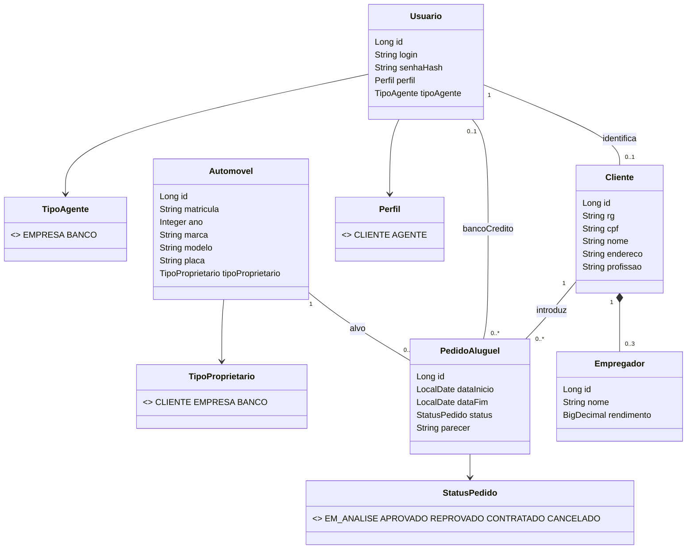
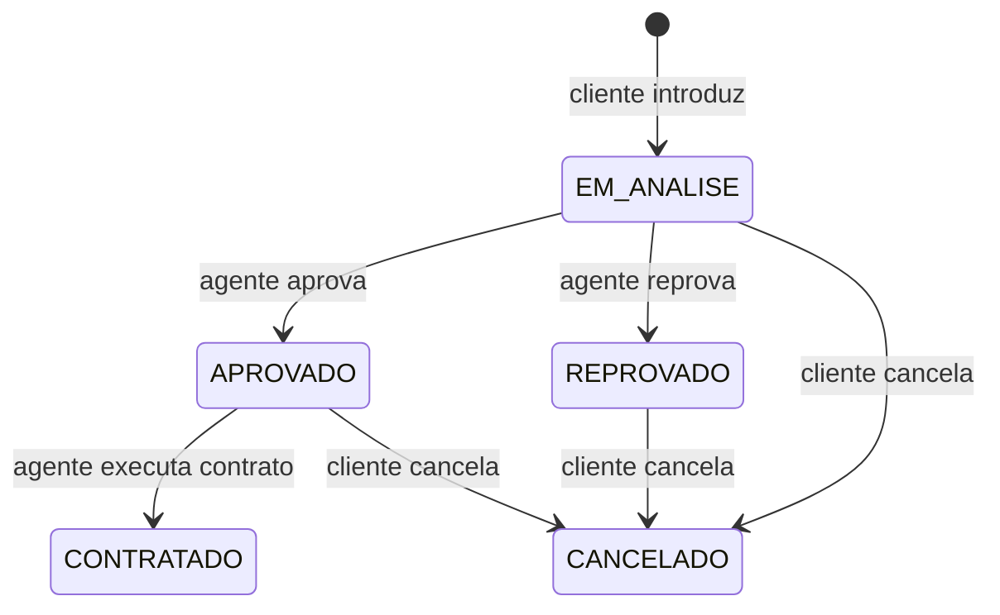

# Diagrama de Classes

```mermaid
classDiagram
    class Usuario {
        Long id
        String login
        String senhaHash
        Perfil perfil
        TipoAgente tipoAgente
    }
    class Cliente {
        Long id
        String rg
        String cpf
        String nome
        String endereco
        String profissao
    }
    class Empregador {
        Long id
        String nome
        BigDecimal rendimento
    }
    class Automovel {
        Long id
        String matricula
        Integer ano
        String marca
        String modelo
        String placa
        TipoProprietario tipoProprietario
    }
    class PedidoAluguel {
        Long id
        LocalDate dataInicio
        LocalDate dataFim
        StatusPedido status
        String parecer
    }
    class Perfil { <<enumeration>> CLIENTE AGENTE }
    class TipoAgente { <<enumeration>> EMPRESA BANCO }
    class TipoProprietario { <<enumeration>> CLIENTE EMPRESA BANCO }
    class StatusPedido { <<enumeration>> EM_ANALISE APROVADO REPROVADO CONTRATADO CANCELADO }

    Usuario "1" -- "0..1" Cliente : identifica
    Cliente "1" *-- "0..3" Empregador
    Cliente "1" -- "0..*" PedidoAluguel : introduz
    Automovel "1" -- "0..*" PedidoAluguel : alvo
    Usuario "0..1" -- "0..*" PedidoAluguel : bancoCredito
    Usuario --> Perfil
    Usuario --> TipoAgente
    Automovel --> TipoProprietario
    PedidoAluguel --> StatusPedido
```

## Maquina de estados do pedido

```mermaid
stateDiagram-v2
    [*] --> EM_ANALISE : cliente introduz
    EM_ANALISE --> APROVADO : agente aprova
    EM_ANALISE --> REPROVADO : agente reprova
    APROVADO --> CONTRATADO : agente executa contrato
    EM_ANALISE --> CANCELADO : cliente cancela
    APROVADO --> CANCELADO : cliente cancela
    REPROVADO --> CANCELADO : cliente cancela
```
